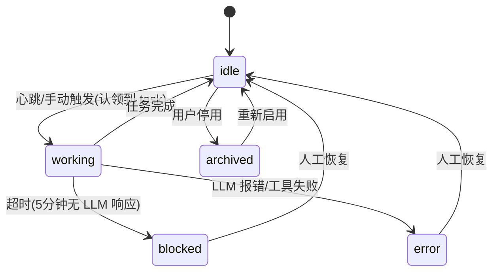
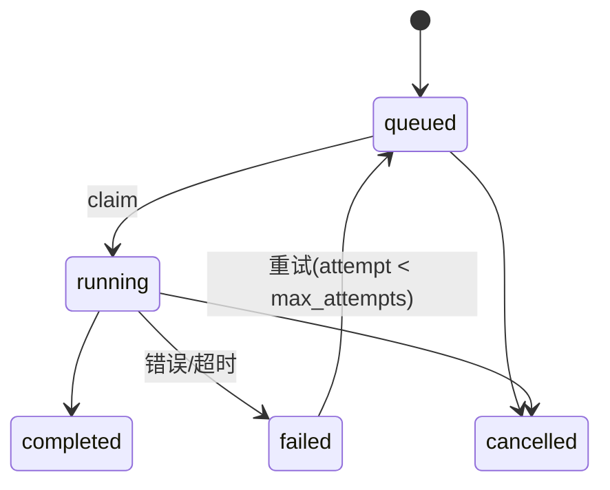

# Spec · 多 Agent 机制设计

> **定位**:Phase 5 的深化与重构。把当前的"per-folder 单次巡检"升级为"Agent 实体 + 任务队列 + 状态机"的标准多 Agent 架构。
> **背景**:参考 multica 的多 Agent 设计,针对 workshop 的 Electron 单机场景做精简适配。
> **依赖**:[TechnicalArchitecture.md](./TechnicalArchitecture.md) · [PRD.md](./PRD.md) · [ROADMAP.md](./ROADMAP.md)
> **参考**:multica 项目(`d:\code\multica`)、agent_study 状态机(`d:\code\agent_study`)

---

## 0. 背景与动机

### 0.1 当前架构的局限

当前 [AgentService.ts](file:///d:/code/workshop/src/core/agent/AgentService.ts) 的设计:

- `agent_configs.folder_id PRIMARY KEY` —— 每个 folder 一条配置,Agent 不是独立实体
- `runAgentOnce(folderId, config)` —— 同步阻塞调用,无队列无并发控制
- 心跳中 `Promise.all(folders.map(runAgentOnce))` —— 同一 folder 可能被并发触发两次
- 全部 agent 共用一个 DeepSeek 配置 —— 无法按角色配不同 model / key
- Agent 无状态机 —— 卡死后无法恢复,只能重启
- 无任务溯源 —— LLM 调用没有可观测性 trace

### 0.2 目标

- Agent 升级为一等实体,可复用、可挂载到多个 folder
- 引入任务队列,保证"同一 (agent, folder) 串行,跨 agent 并行"
- 双层状态机(Agent 层 + Task 层),崩溃可恢复
- LLM 调用溯源链,支持 trace 和成本归因
- 单机简化,不引入 multica 的权限模型 / Redis / Squad

---

## 1. 核心设计

### 1.1 设计原则

| 原则 | 说明 |
|---|---|
| Agent 实体化 | prompt / model / tools 从"配置项"提升为"可复用的角色定义" |
| 任务队列驱动 | 所有 Agent 执行都走队列,不直接调 LLM |
| 双层状态机 | Agent 层(idle/working/...) + Task 层(queued/running/...) |
| 配置继承 | Agent 级配置覆盖全局 default,null = 继承 |
| 单机优先 | 不做权限模型、不做跨节点广播、不做 A2A 防绕过 |

### 1.2 借鉴 multica 的三个关键模式

1. **原子认领**(简化版):用 SQLite `BEGIN IMMEDIATE` 事务 + `NOT EXISTS` 子查询,保证"同一 (agent, folder) 同时只有一个任务在跑"
2. **Attribution 链**:`originator` + `originator_agent_id` 两字段,所有 agent→agent 调用可追溯到最初触发者
3. **状态由 task 推导**:Agent 的 `status` 不是单独维护,而是从其 task 状态推导(借鉴 multica `RefreshAgentStatusFromTasks`)

### 1.3 借鉴 agent_study 的状态机设计

参考 [agent_study TASK_STATE_MACHINE.md](file:///d:/code/agent_study/docs/TASK_STATE_MACHINE.md):

- 状态转换合法性校验(非法迁移抛错)
- 终态不可变(completed/failed/cancelled)
- 乐观锁 version 字段
- 预算控制(模型调用次数、token 上限)

**区别**:agent_study 关注"单个 task 内部 ReAct loop",workshop 关注"多 agent 宏观状态"。

---

## 2. 数据模型

### 2.1 新增三张表

#### 2.1.1 `agents` 表 —— Agent 实体定义(全局)

```sql
CREATE TABLE IF NOT EXISTS agents (
  id TEXT PRIMARY KEY,
  name TEXT NOT NULL,
  description TEXT,

  -- LLM 配置(null = 继承全局 default)
  system_prompt TEXT NOT NULL,
  model TEXT,                    -- null = 继承全局
  api_key_override TEXT,         -- null = 继承全局
  base_url_override TEXT,        -- null = 继承全局
  temperature REAL DEFAULT 0.7,

  -- 工具与并发
  tools TEXT DEFAULT '[]',      -- JSON 数组,如 ["read_folder","create_todo","send_email"]
  max_concurrent_tasks INTEGER DEFAULT 1,

  -- 状态机
  status TEXT CHECK(status IN ('idle','working','blocked','error','archived')) DEFAULT 'idle',
  version INTEGER DEFAULT 1,     -- 乐观锁

  -- 软删除
  archived_at INTEGER,

  -- 预算(借鉴 agent_study)
  max_model_calls_per_run INTEGER DEFAULT 5,
  max_tokens_per_run INTEGER DEFAULT 10000,

  created_at INTEGER NOT NULL,
  updated_at INTEGER NOT NULL
);
CREATE INDEX IF NOT EXISTS idx_agents_status ON agents(status);
```

#### 2.1.2 `folder_agents` 表 —— Agent 与 Folder 多对多关联

```sql
CREATE TABLE IF NOT EXISTS folder_agents (
  folder_id TEXT NOT NULL,
  agent_id TEXT NOT NULL,
  strategy TEXT,                  -- 'follow_up' | 'collect' | 'sync' | 'custom'
  permissions TEXT DEFAULT '{}',  -- JSON: 能否写 todo、能否发邮件等
  enabled INTEGER DEFAULT 1,
  PRIMARY KEY (folder_id, agent_id),
  FOREIGN KEY(folder_id) REFERENCES folders(id) ON DELETE CASCADE,
  FOREIGN KEY(agent_id) REFERENCES agents(id) ON DELETE CASCADE
);
CREATE INDEX IF NOT EXISTS idx_folder_agents_agent ON folder_agents(agent_id);
```

**说明**:
- 一个 agent 可挂多个 folder(催办专员挂 50 个 folder)
- 一个 folder 可挂多个 agent(催办 + 归集各一个)
- `permissions` JSON 控制该挂载点的细粒度权限,如 `{"can_write_todo": true, "can_send_email": false}`

#### 2.1.3 `agent_tasks` 表 —— 任务队列

```sql
CREATE TABLE IF NOT EXISTS agent_tasks (
  id TEXT PRIMARY KEY,
  agent_id TEXT NOT NULL,
  folder_id TEXT,                 -- null = 全局任务(非舱内)

  -- 任务来源 + 溯源(关键: attribution 链)
  originator TEXT NOT NULL,       -- 'human' | 'agent' | 'system' | 'cron'
  originator_agent_id TEXT,       -- 触发此任务的 agent(链式调用溯源)

  -- 触发信息
  trigger_kind TEXT,              -- 'heartbeat' | 'mention' | 'manual' | 'deadline' | 'child_done'
  trigger_ref TEXT,               -- 如触发的 todo_id / timeline_id

  -- 输入
  prompt TEXT,                    -- 任务输入(已构造好的)
  context TEXT,                   -- JSON: folder 快照、相关 todos 等

  -- 调度
  priority INTEGER DEFAULT 0,    -- 大值优先
  status TEXT CHECK(status IN ('queued','running','completed','failed','cancelled','deferred')) DEFAULT 'queued',

  -- 执行时间戳
  started_at INTEGER,
  completed_at INTEGER,

  -- 结果
  result TEXT,                    -- JSON: 输出、建议
  error TEXT,

  -- 资源使用(溯源 + 成本归因)
  token_usage INTEGER DEFAULT 0,
  model_calls INTEGER DEFAULT 0,

  -- 重试
  retry_of_task_id TEXT,          -- 重试原任务
  attempt INTEGER DEFAULT 0,
  max_attempts INTEGER DEFAULT 2,

  created_at INTEGER NOT NULL,
  FOREIGN KEY(agent_id) REFERENCES agents(id),
  FOREIGN KEY(folder_id) REFERENCES folders(id)
);
CREATE INDEX IF NOT EXISTS idx_tasks_claim ON agent_tasks(status, priority DESC, created_at);
CREATE INDEX IF NOT EXISTS idx_tasks_agent ON agent_tasks(agent_id, status);
CREATE INDEX IF NOT EXISTS idx_tasks_folder ON agent_tasks(folder_id);
```

### 2.2 配置继承优先级

借鉴 multica 的 `COALESCE` + 显式 clear 模式:

```typescript
function resolveAgentLLMConfig(agent: Agent, globalConfig: DeepSeekConfig): ResolvedLLMConfig {
  return {
    apiKey:   agent.api_key_override   ?? globalConfig.apiKey,
    model:    agent.model              ?? globalConfig.model,
    baseUrl:  agent.base_url_override  ?? globalConfig.baseUrl,
    prompt:   agent.system_prompt,  // 每个 agent 必须独立
    temperature: agent.temperature,
  };
}
```

**效果**:
- 简单催办 agent:全部继承默认(便宜)
- 复杂推理 agent:`model='deepseek-reasoner'` + 独立 key(贵但准)
- 额度隔离:某 agent 调用频繁,配独立 key 不影响其他 agent

### 2.3 与现有 `agent_configs` 表的关系

- **保留** `agent_configs` 表(向后兼容)
- **迁移**:`agent_configs.strategy` → `folder_agents.strategy`
- **降级**:`agent_configs` 未来作为"folder 级别覆盖配置"(per-folder 覆盖 agent 默认值),可选
- **新建默认 agent**:首次迁移时,根据现有 `agent_configs` 数据创建一个全局 "default-followup" agent,挂到所有 enabled folder

---

## 3. 状态机

### 3.1 Agent 层状态机(宏观)



**转换合法性**:

```typescript
const AGENT_TRANSITIONS: Record<AgentStatus, AgentStatus[]> = {
  idle:     ['working', 'archived'],
  working:  ['idle', 'blocked', 'error', 'archived'],
  blocked:  ['idle', 'error', 'archived'],
  error:    ['idle', 'archived'],
  archived: ['idle'],
};

function transitionAgent(agentId: string, from: AgentStatus, to: AgentStatus) {
  if (!AGENT_TRANSITIONS[from].includes(to)) {
    throw new Error(`非法 Agent 状态转换: ${from} → ${to}`);
  }
  // 乐观锁: 必须匹配当前 version 才能更新
  const result = db.prepare(`
    UPDATE agents SET status = ?, version = version + 1, updated_at = ?
    WHERE id = ? AND version = ?
  `).run(to, Date.now(), agentId, currentVersion);
  if (result.changes === 0) throw new Error('乐观锁冲突: agent 已被其他操作修改');
}
```

### 3.2 Task 层状态机(微观)



**终态**:`completed` / `failed`(attempt 用尽) / `cancelled` 不可变。

### 3.3 状态由 task 推导(借鉴 multica)

Agent 的 `status` 不直接维护,而是由其 task 状态推导。每次心跳末尾跑一次:

```sql
-- refreshAgentStatus: 从 task 状态刷新所有 agent 的 status
UPDATE agents
SET status = CASE
  WHEN archived_at IS NOT NULL THEN 'archived'
  WHEN EXISTS (
    SELECT 1 FROM agent_tasks
    WHERE agent_id = agents.id AND status = 'running'
  ) THEN 'working'
  WHEN EXISTS (
    SELECT 1 FROM agent_tasks
    WHERE agent_id = agents.id AND status = 'failed'
      AND completed_at > ? -- 最近 1 小时
  ) THEN 'error'
  WHEN EXISTS (
    SELECT 1 FROM agent_tasks
    WHERE agent_id = agents.id AND status = 'running'
      AND started_at < ? -- 5 分钟前开始还没结束
  ) THEN 'blocked'
  ELSE 'idle'
END,
version = version + 1,
updated_at = ?
WHERE archived_at IS NULL;
```

### 3.4 崩溃恢复(启动时跑一次)

借鉴 multica `RecoverOrphanedTasks`:

```typescript
function recoverOnStartup() {
  const now = Date.now();
  const FIVE_MIN = 5 * 60 * 1000;

  // 1. Task 层:启动时把所有 running 但超时的 task 标为 failed
  db.prepare(`
    UPDATE agent_tasks
    SET status = 'failed', error = 'process_restart_orphaned', completed_at = ?
    WHERE status = 'running' AND started_at < ?
  `).run(now, now - FIVE_MIN);

  // 2. Agent 层:把所有 working 的 agent 改回 idle(由 refreshAgentStatus 兜底)
  db.prepare(`
    UPDATE agents SET status = 'idle', version = version + 1, updated_at = ?
    WHERE status = 'working'
  `).run(now);

  // 3. 刷新一次状态(确保一致)
  refreshAgentStatus(now - 60 * 60 * 1000, now - FIVE_MIN, now);
}
```

---

## 4. 任务队列与原子认领

### 4.1 设计目的(回答"为什么需要这些")

| 问题 | 没有队列会怎样 | 队列如何解决 |
|---|---|---|
| 同一 folder 被并发触发两次 | 心跳 + 用户手动点击同时跑,重复扣费 | `NOT EXISTS` 子查询阻止并发 |
| 进程崩溃 | 内存状态丢失,无法恢复 | DB 持久化,重启时 `recoverOnStartup` |
| 多 agent 抢同一 folder | 两个 agent 都觉得该管,资源浪费 | 每个 (agent, folder) 独立任务行 |
| 调用溯源 | 不知道哪个 agent 触发了哪个 | `originator_agent_id` 链式追溯 |
| 成本归因 | 不知道哪个 agent 烧了多少 token | `token_usage` + `agent_id` 聚合 |

### 4.2 原子认领实现(SQLite 版)

SQLite 不支持 `FOR UPDATE SKIP LOCKED`,用 `BEGIN IMMEDIATE` + 事务内 `SELECT ... UPDATE` 等价:

```typescript
async function claimNextTask(agentId: string): Promise<AgentTask | null> {
  db.exec('BEGIN IMMEDIATE');  // 获取写锁
  try {
    // 1. 找一个待跑的任务(关键: NOT EXISTS 保证串行)
    const task = db.prepare(`
      SELECT * FROM agent_tasks
      WHERE agent_id = ? AND status = 'queued'
        AND NOT EXISTS (
          SELECT 1 FROM agent_tasks active
          WHERE active.agent_id = agent_tasks.agent_id
            AND active.status = 'running'
            AND active.folder_id IS NOT NULL
            AND active.folder_id = agent_tasks.folder_id
        )
      ORDER BY priority DESC, created_at ASC
      LIMIT 1
    `).get(agentId) as AgentTask | undefined;

    if (!task) {
      db.exec('COMMIT');
      return null;
    }

    // 2. 标记为 running(只有拿到锁的线程能改这一行)
    db.prepare(`
      UPDATE agent_tasks
      SET status = 'running', started_at = ?
      WHERE id = ? AND status = 'queued'
    `).run(Date.now(), task.id);

    db.exec('COMMIT');
    return task;
  } catch (e) {
    db.exec('ROLLBACK');
    throw e;
  }
}
```

### 4.3 任务入队入口

```typescript
interface EnqueueTaskInput {
  agentId: string;
  folderId?: string;
  originator: 'human' | 'agent' | 'system' | 'cron';
  originatorAgentId?: string;
  triggerKind: 'heartbeat' | 'mention' | 'manual' | 'deadline' | 'child_done';
  triggerRef?: string;
  prompt: string;
  context?: Record<string, unknown>;
  priority?: number;
}

function enqueueTask(input: EnqueueTaskInput): string {
  // 循环调用检测(防 agent-a → agent-b → agent-a 无限循环)
  if (input.originatorAgentId) {
    const chain = traceOriginatorChain(input.originatorAgentId);
    if (chain.includes(input.agentId)) {
      console.warn(`循环调用检测: agent ${input.agentId} 在自己的溯源链里`);
      return '';
    }
  }

  const id = `task-${Date.now()}-${Math.random().toString(36).slice(2, 8)}`;
  db.prepare(`
    INSERT INTO agent_tasks (id, agent_id, folder_id, originator, originator_agent_id,
      trigger_kind, trigger_ref, prompt, context, priority, status, created_at)
    VALUES (?, ?, ?, ?, ?, ?, ?, ?, ?, ?, 'queued', ?)
  `).run(id, input.agentId, input.folderId ?? null, input.originator,
        input.originatorAgentId ?? null, input.triggerKind, input.triggerRef ?? null,
        input.prompt, input.context ? JSON.stringify(input.context) : null,
        input.priority ?? 0, Date.now());
  return id;
}
```

### 4.4 任务完成

```typescript
function completeTask(taskId: string, result: AgentResult, tokenUsage: number) {
  db.prepare(`
    UPDATE agent_tasks
    SET status = 'completed', result = ?, token_usage = ?, completed_at = ?
    WHERE id = ? AND status = 'running'
  `).run(JSON.stringify(result), tokenUsage, Date.now(), taskId);
}

function failTask(taskId: string, error: string, attempt: number, maxAttempts: number) {
  // 失败后是否重试
  if (attempt < maxAttempts) {
    const newTaskId = `task-${Date.now()}-${Math.random().toString(36).slice(2, 8)}`;
    db.prepare(`
      INSERT INTO agent_tasks (id, agent_id, folder_id, originator, originator_agent_id,
        trigger_kind, trigger_ref, prompt, context, priority, status,
        retry_of_task_id, attempt, max_attempts, created_at)
      SELECT ?, agent_id, folder_id, originator, originator_agent_id,
        trigger_kind, trigger_ref, prompt, context, priority, 'queued',
        ?, ?, ?, ?
      FROM agent_tasks WHERE id = ?
    `).run(newTaskId, taskId, attempt + 1, maxAttempts, Date.now(), taskId);
  }
  db.prepare(`
    UPDATE agent_tasks SET status = 'failed', error = ?, completed_at = ?
    WHERE id = ?
  `).run(error, Date.now(), taskId);
}
```

---

## 5. Worker Pool

### 5.1 设计(Node 单进程版)

不引入 `worker_threads`(单机 Electron 没必要),用 `Promise.all` + 信号量:

```typescript
// src/core/agent/AgentWorkerPool.ts
import { EventEmitter } from 'node:events';

export interface WorkerPoolOptions {
  maxConcurrentAgents: number;   // 默认 3,单机别开太多
  heartbeatIntervalMs: number;   // 默认 30 min
  taskTimeoutMs: number;          // 默认 5 min,超过标为 blocked
}

export class AgentWorkerPool extends EventEmitter {
  private activeTasks = new Map<string, Promise<void>>(); // taskId → promise
  private running = false;

  constructor(
    private opts: WorkerPoolOptions,
    private deepSeekConfig: DeepSeekConfig,
  ) { super(); }

  async start() {
    this.running = true;
    // 心跳循环
    setInterval(() => this.tick(), this.opts.heartbeatIntervalMs);
    // 立即跑一次
    this.tick();
  }

  stop() { this.running = false; }

  private async tick() {
    if (!this.running) return;

    // 1. 恢复孤儿任务(启动时和每次 tick 都检查)
    await this.recoverOrphanedTasks();

    // 2. 刷新 agent 状态
    await this.refreshAgentStatus();

    // 3. 对每个 idle 的 agent 尝试认领任务
    const idleAgents = await this.listIdleAgents();
    await Promise.all(idleAgents.map(a => this.tryClaimAndRun(a.id)));
  }

  private async tryClaimAndRun(agentId: string) {
    // 并发上限
    if (this.activeTasks.size >= this.opts.maxConcurrentAgents) return;

    const task = await claimNextTask(agentId);
    if (!task) return;

    const promise = this.executeTask(task)
      .finally(() => this.activeTasks.delete(task.id));
    this.activeTasks.set(task.id, promise);
  }

  private async executeTask(task: AgentTask) {
    try {
      // 1. 设置 agent status = 'working'
      // 2. 解析 agent 配置(继承全局)
      // 3. 构造 LLM 输入
      // 4. 调 DeepSeek(带 timeout)
      // 5. 解析输出 → 执行 tools
      // 6. 写 timeline + completeTask
      // 7. emit('task:done', result) → IPC 推送给 renderer
    } catch (e) {
      // failTask + 决定是否重试
    }
  }

  private async recoverOrphanedTasks() {
    // 见 3.4
  }

  private async refreshAgentStatus() {
    // 见 3.3
  }
}
```

### 5.2 IPC 事件推送

```typescript
// 任务完成后推送给 renderer
mainWindow.webContents.send('agent:task-done', {
  taskId: task.id,
  agentId: task.agent_id,
  agentName: agent.name,
  folderId: task.folder_id,
  folderName: folder.name,
  summary: result.summary,
  action: result.action,
  ok: result.ok,
  timestamp: Date.now(),
});

// agent 状态变化推送
mainWindow.webContents.send('agent:status-changed', {
  agentId,
  status: 'working' | 'idle' | 'blocked' | 'error',
  version: newVersion,
});
```

---

## 6. Attribution 链与可观测性

### 6.1 溯源字段

每条 `agent_tasks` 行携带:

- `originator`:最初触发者类型(`human` / `agent` / `system` / `cron`)
- `originator_agent_id`:如果是 agent 触发的,指向触发 agent

### 6.2 作用

#### 作用 1:链式调用追溯(可观测性 trace)

```
T0: 用户在 folder-A 点"立即执行 agent-1"
    → task-001, originator='human', originator_agent_id=null

T1: agent-1 跑完,在 timeline 写:"已催办,建议 agent-2 跟进材料"
    → mention 路由为 agent-2 创建 task-002
    → task-002, originator='agent', originator_agent_id=agent-1

T2: agent-2 跑完
    → task-003, originator='agent', originator_agent_id=agent-2
```

**UI 显示**:
```
agent-3 刚刚执行了"摘要生成"
  ↑ 由 agent-2 触发(材料归集)
  ↑ 由 agent-1 触发(催办专员)
  ↑ 由用户触发(立即执行)
```

#### 作用 2:成本归因

```sql
-- 本周每个 agent 烧了多少 token
SELECT a.name, COUNT(t.id) as task_count, SUM(t.token_usage) as total_tokens
FROM agent_tasks t JOIN agents a ON t.agent_id = a.id
WHERE t.completed_at > ? GROUP BY a.id;

-- 某个 folder 一共烧了多少 token
SELECT folder_id, SUM(token_usage) as total_tokens
FROM agent_tasks WHERE folder_id = ? AND status = 'completed';
```

#### 作用 3:防循环调用

```typescript
// 见 4.3 enqueueTask 中的循环检测
function traceOriginatorChain(agentId: string): string[] {
  // 查 task 表的 originator_agent_id 链,返回溯源 agent id 数组
}
```

#### 作用 4:失败重试时的上下文

- `originator='human'` → 人类触发,可自动重试
- `originator='agent'` → agent 触发,需要先看上游 agent 是否还在跑

### 6.3 @mention 路由(简化版,不照搬 multica squad)

```typescript
// Agent A 在 timeline 写:"已催办 [@agent-b](mention://agent/agent-b-id) 继续跟进"
function routeMention(timelineEntry: TimelineEntry) {
  const mentions = parseMentions(timelineEntry.action);
  for (const m of mentions) {
    if (m.type === 'agent') {
      enqueueTask({
        agentId: m.id,
        folderId: timelineEntry.folderId,
        originator: 'agent',
        originatorAgentId: timelineEntry.actor === 'agent' ? timelineEntry.actorId : undefined,
        triggerKind: 'mention',
        triggerRef: timelineEntry.id,
        prompt: '前序 Agent 留言,请继续处理',
        context: { parent_timeline_id: timelineEntry.id },
      });
    }
  }
}
```

---

## 7. 隔离(单机简化版)

不学 multica 的 `mat_ token + workspace 绑定`(单机无多用户,无 A2A 滥用风险),只做逻辑隔离:

### 7.1 Agent 执行上下文

```typescript
interface AgentExecutionContext {
  agentId: string;
  agentName: string;
  systemPrompt: string;
  allowedTools: string[];       // 白名单
  visibleFolderIds: string[];  // 可见的 folder(默认全部,可限制)
  maxTokensPerRun: number;     // quota
  maxModelCallsPerRun: number;
}
```

### 7.2 工具白名单示例

| 工具 | 默认 | 说明 |
|---|---|---|
| `read_folder` | ✅ | 所有 agent 可用 |
| `create_todo` | ❌ | 需在 permissions 里开启 |
| `send_email` | ❌ | 高危,默认禁用 |
| `update_progress` | ✅ | 默认启用 |

### 7.3 预算控制(借鉴 agent_study)

每个 agent 每次执行有硬上限:

| 项目 | 默认上限 |
|---|---|
| 模型调用 | 5 次 |
| 工具调用 | 10 次 |
| 总 token | 10,000 |
| 活跃执行时间 | 300 秒 |
| 重试次数 | 2 次 |

超预算直接 `failTask`,不重试。

---

## 8. 明确不做的事(避免过度设计)

| 不做 | 原因 |
|---|---|
| `permission_mode` + `invocation_targets` 权限模型 | 单机无多用户,无 A2A 滥用风险 |
| Redis / DualWriteBroadcaster 跨节点广播 | 单进程,IPC + EventEmitter 即可 |
| Squad leader / 硬编码协调协议 | 个人场景 mention 路由够了 |
| 16 个 provider backend | 只用 DeepSeek,一个 backend 够 |
| `task_token` + workspace 绑定 | 单机无安全需求 |
| `X-Actor-Source` 服务端独占 | 无网络层,无伪造风险 |
| A2A 防绕过(按溯源人类判断权限) | 无权限模型,不需要 |
| `worker_threads` | Promise.all 够用,无需多线程 |
| agent_study 的 task_events / task_traces append-only | 单机用 timeline + agent_tasks 够 |

---

## 9. 实施路径

### 9.1 当前位置

- **Phase 0-4**:已完成
- **Phase 5**:已完成(但 Agent 部分需要重构)
- **本 spec 的位置**:Phase 5 的深化,为 Phase 6+ 打基础

### 9.2 子任务拆分

| 步骤 | 模块 | 产出 | 依赖 |
|---|---|---|---|
| S1 | `src/core/db/schema.ts` | `SCHEMA_VERSION = 2`,新增 `agents` / `folder_agents` / `agent_tasks` 三张表 + 迁移逻辑 | — |
| S2 | `src/core/db/seed.ts` | 从现有 `agent_configs` 数据迁移:创建默认 agent + 挂载关系到 `folder_agents` | S1 |
| S3 | `src/core/repositories/agentRepository.ts` | Agent CRUD + `findById` / `listIdle` / `updateStatus`(带乐观锁) | S1 |
| S4 | `src/core/repositories/agentTaskRepository.ts` | Task CRUD + `claimNextTask`(原子认领) + `completeTask` / `failTask` / `enqueueTask` | S1 |
| S5 | `src/core/repositories/folderAgentRepository.ts` | 关联表 CRUD + `listByFolder` / `listByAgent` | S1 |
| S6 | `src/core/agent/configResolver.ts` | `resolveAgentLLMConfig`(继承优先级) | S3 |
| S7 | `src/core/agent/stateMachine.ts` | `AGENT_TRANSITIONS` + `transitionAgent` + `refreshAgentStatus` + `recoverOnStartup` | S3 |
| S8 | `src/core/agent/attribution.ts` | `traceOriginatorChain` + `routeMention` + 循环检测 | S4 |
| S9 | `src/core/agent/AgentWorkerPool.ts` | Worker Pool 主循环 + IPC 事件推送 | S3-S8 |
| S10 | `src/core/agent/AgentService.ts` 重构 | 从 `runAgentOnce` 改为 `enqueueAndRun`,接入任务队列 | S9 |
| S11 | `src/main/index.ts` | 启动时调 `recoverOnStartup` + 注册 WorkerPool + IPC handler(`agent:trigger` / `agent:pause` / `agent:status`) | S9, S10 |
| S12 | `src/main/scheduler.ts` | 心跳委托 WorkerPool.tick | S9 |
| S13 | `src/preload/index.ts` | 暴露 `triggerAgent` / `pauseAgent` / `listAgents` / `getAgentStatus` | S11 |
| S14 | `src/renderer/store/useMissionStore.ts` | 接 IPC + 监听 `agent:task-done` / `agent:status-changed` 事件 | S13 |
| S15 | 验证 | typecheck + build + 心跳触发多 agent 并发 + 崩溃恢复测试 | S14 |

### 9.3 验收标准

- [ ] `agents` 表存在,可创建/编辑/归档 agent
- [ ] 同一 (agent, folder) 同时只有一个 task 在跑(原子认领)
- [ ] 多个 agent 并发跑不同 folder(跨 agent 并行)
- [ ] Agent 状态机:idle → working → idle 正常流转
- [ ] Agent 状态机:超时 → blocked,可人工恢复
- [ ] Agent 状态机:错误 → error,可人工恢复
- [ ] 进程崩溃后重启,`recoverOnStartup` 把孤儿 task 标为 failed
- [ ] Task 重试:失败后 attempt < max_attempts 时自动重试
- [ ] Attribution 链:agent→agent 调用可追溯
- [ ] 循环调用检测:agent-a → agent-b → agent-a 被阻止
- [ ] 成本归因:可查询每个 agent / folder 的 token 消耗
- [ ] IPC 事件:任务完成推送给 renderer,UI 更新

### 9.4 与后续 Phase 的关系

| 后续 Phase | 依赖本 spec 的部分 |
|---|---|
| Phase 6(邮件接口) | Agent 可调 `send_email` 工具,触发时入队 |
| Phase 7(飞书接口) | 同上,Agent 可调飞书工具 |
| Phase 8(文件归档) | Agent 可调 `archive_file` 工具 |
| Phase 9(打包发布) | 不影响,本 spec 已完成 |

---

## 10. 关键设计决策记录

### 10.1 为什么不做 multica 的权限模型

- **multica 场景**:多用户云端平台,需要防 A2A 滥用、防 admin 越权
- **workshop 场景**:单机单用户,无网络层,无伪造风险
- **决策**:只做工具白名单(`allowedTools`),不做 `permission_mode` + `invocation_targets`

### 10.2 为什么不做 Redis 跨节点广播

- **multica 场景**:多 API 节点部署,需要跨节点 fanout
- **workshop 场景**:Electron 单进程,IPC + EventEmitter 即可
- **决策**:Broadcaster 接口保留(未来可扩展),但 MVP 用 EventEmitter

### 10.3 为什么不做 Squad 协调模式

- **multica 场景**:企业级多 agent 协作,需要 leader/worker 显式角色
- **workshop 场景**:个人用户,mention 路由已足够
- **决策**:用简化版 @mention 路由,不引入 squad 概念

### 10.4 为什么 SQLite 不用 `FOR UPDATE SKIP LOCKED`

- **multica 场景**:PostgreSQL,原生支持 `SKIP LOCKED`
- **workshop 场景**:SQLite,不支持 `SKIP LOCKED`
- **决策**:用 `BEGIN IMMEDIATE` + 事务内 `SELECT ... UPDATE` 等价实现

### 10.5 为什么不用 `worker_threads`

- **multica 场景**:Go goroutine,天然轻量
- **workshop 场景**:Node `worker_threads` 启动开销大,且 LLM 调用是 IO 密集型,单进程 `Promise.all` 已足够
- **决策**:纯 `Promise.all` + 信号量控制并发上限

### 10.6 为什么保留 `agent_configs` 表

- **原因**:向后兼容,现有数据不丢
- **定位**:降级为"folder 级别覆盖配置"(per-folder 覆盖 agent 默认值),可选
- **未来**:可考虑废弃,全部合并到 `folder_agents.permissions`

---

## 11. 文件结构

```
src/core/
├── agent/
│   ├── AgentService.ts          ← 重构:从 runAgentOnce 改为 enqueueAndRun
│   ├── AgentWorkerPool.ts       ← 新增:Worker Pool 主循环
│   ├── configResolver.ts        ← 新增:配置继承优先级
│   ├── stateMachine.ts          ← 新增:状态机 + 状态推导
│   ├── attribution.ts           ← 新增:溯源链 + mention 路由
│   └── strategies/              ← 现有:催办/归集/同步策略
├── db/
│   └── schema.ts                ← 修改:SCHEMA_VERSION = 2,新增 3 张表
├── repositories/
│   ├── agentRepository.ts       ← 新增:Agent CRUD
│   ├── agentTaskRepository.ts   ← 新增:Task CRUD + 原子认领
│   └── folderAgentRepository.ts ← 新增:关联表 CRUD
```

---

## 12. 参考文档

- [multica 多 Agent 机制调研报告](file:///d:/code/multica/AGENTS.md)
- [agent_study TaskState 状态机](file:///d:/code/agent_study/docs/TASK_STATE_MACHINE.md)
- [agent_study 数据模型](file:///d:/code/agent_study/specs/001-agent-task-state-machine/data-model.md)
- [workshop 技术架构](file:///d:/code/workshop/.trae/documents/TechnicalArchitecture.md)
- [workshop 路线图](file:///d:/code/workshop/.trae/documents/ROADMAP.md)
