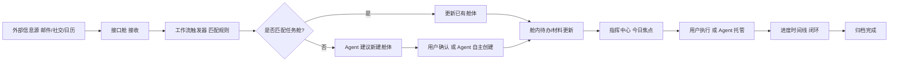

# PRD · 任务指挥中心（Mission Console）

## 1. 产品概述

一款面向"拖延症 + 易遗忘"个人用户的本地优先任务指挥工作台。将每一类任务抽象为独立"任务舱（Folder）"，舱内聚合完成该任务所需的全部材料、待办、Agent 托管规则与进度时间线；通过可扩展的接口层接入邮件、社交与日历，构建从"信息收集 → 任务生成 → Agent 跟进 → 进度闭环"的完整工作流，解决日常事项遗漏与进度不透明的痛点。

- 目标用户：个人知识工作者、独立开发者、自由职业者，日常多线任务并行、易遗漏跟进事项
- 核心价值：把"明天该做什么"交给 Agent 持续追踪；把"完成这件事需要什么"聚合进一个舱体；把"信息从哪里来"统一为可插拔接口

## 2. 核心功能

### 2.1 用户角色
| 角色 | 注册方式 | 核心权限 |
|------|----------|----------|
| 个人用户（单机模式） | 本地首次启动初始化 | 全部功能：创建舱体、配置 Agent、接入接口、构建工作流 |

### 2.2 功能模块
1. **指挥中心（Dashboard）**：今日焦点、逾期雷达、Agent 活动流、全局进度环、AI 副驾对话面板
2. **任务舱库（Folders）**：所有任务文件夹的网格/列表视图，按状态/优先级/截止日筛选与排序
3. **任务舱详情（Folder Interior）**：单舱内的待办清单、材料库、Agent 托管面板、进度时间线、笔记
4. **接口舱（Integrations）**：邮件 / 日历 / 社交软件接入管理，连接状态与同步日志
5. **工作流编排（Workflow）**：触发器 → 条件 → 动作的可视化规则编排，跨舱跨接口联动
6. **Agent 控制台（Agent Console）**：每个舱的托管策略、自主权限边界、活动审计
7. **设置（Settings）**：DeepSeek API key、仓库目录、心跳间隔、开机自启开关、接口凭据

### 2.3 页面详情
| 页面 | 模块 | 功能描述 |
|------|------|----------|
| 指挥中心 | 今日焦点卡 | 自动汇总今日截止 / 高优先级待办，按舱聚合 |
| 指挥中心 | 逾期雷达 | 逾期事项扫描，红色脉冲提示，一键延期或启动 Agent 催办 |
| 指挥中心 | 进度环 | 全局任务完成率环形图，分舱细分 |
| 指挥中心 | Agent 活动流 | 滚动展示 Agent 自主执行的动作（同步邮件、生成待办、更新进度） |
| 指挥中心 | AI 副驾面板 | 右侧常驻对话栏，可对话生成舱体、查询进度、下达指令 |
| 任务舱库 | 舱体网格 | 卡片式展示，封面色 + 优先级条 + 截止倒计时 + Agent 状态徽标 |
| 任务舱库 | 筛选器 | 按状态、优先级、标签、接口来源筛选；支持搜索 |
| 任务舱库 | 快速创建 | 顶部命令栏，支持自然语言一句话建舱（AI 解析） |
| 任务舱详情 | 待办清单 | 可勾选、拖拽排序、指派给人或 Agent、子任务嵌套 |
| 任务舱详情 | 材料库 | 文档/链接/笔记/截图分类，支持拖拽上传，标注来源接口 |
| 任务舱详情 | Agent 托管面板 | 开关托管、选择策略（跟进催办 / 材料收集 / 进度同步）、权限范围 |
| 任务舱详情 | 进度时间线 | 竖向时间轴，记录每次状态变更、Agent 动作、人工操作 |
| 任务舱详情 | 笔记区 | 富文本笔记，支持引用材料与待办 |
| 接口舱 | 接口卡片 | 每个接入点一张卡片：图标、状态、最近同步、配置入口 |
| 接口舱 | 同步日志 | 接口拉取/推送的原始记录，可回溯 |
| 接口舱 | 可扩展插槽 | 预留通用接口适配器位，显示"即将接入"占位 |
| 工作流 | 规则列表 | 已编排的自动化规则，启停开关 |
| 工作流 | 编排画布 | 节点式：触发器 → 条件分支 → 动作，支持拖拽连线 |
| Agent 控制台 | 策略库 | 预置策略模板（每日跟进、材料归集、进度播报） |
| Agent 控制台 | 审计日志 | Agent 所有自主操作的留痕，可回滚误操作 |
| 设置 | DeepSeek 配置 | API key 输入、模型选择、连接测试按钮 |
| 设置 | 仓库目录 | 让用户选择一个本地文件夹作为归档仓库 |
| 设置 | 心跳调度 | 间隔分钟数（默认 30min，项目初期节流）、全局开关、手动立即触发按钮 |
| 设置 | 系统选项 | 开机自启开关（默认关闭）、托盘图标、快捷键 |
| 设置 | 接口凭据 | 邮件 OAuth/IMAP、飞书 AppID/Secret 等凭据管理 |

## 3. 核心流程

**主流程 A — 从信息到任务舱**：邮件/社交接口收到信息 → 工作流触发器匹配规则 → Agent 自动生成或更新任务舱 → 待办入库 → 指挥中心今日焦点呈现 → 用户确认或 Agent 托管执行

**主流程 B — 任务舱内闭环**：进入舱体 → 查看待办与材料 → 执行并勾选 → 进度时间线自动更新 → Agent 在截止前主动催办 → 完成归档

**主流程 C — Agent 托管**：用户在舱内开启托管 → 选择策略与权限边界 → Agent 按策略自主同步接口、催办、生成子任务 → 每次动作写入审计日志 → 用户可随时介入或回滚

**主流程 D — Agent 暂停与恢复**：用户主动暂停 → Agent 心跳跳过此舱 → 所有进度写回 SQLite → 关机/退出时数据完整保留 → 开机启动 → 读 SQLite 恢复 → 用户可手动触发"立即执行"或等待下一次心跳

## 4. 用户界面设计

### 4.1 设计风格
**美学方向：Obsidian Mission Console（黑曜石指挥台）** —— 介于科幻指挥中心与精密仪器表盘之间，冷峻、信息密度高、可读性优先，绝不使用紫色渐变与居中堆叠卡片。

- **主色系**
  - 背景：近黑曜石 `#0A0E14` → `#0F141C`（带极淡冷蓝底调，非纯黑）
  - 面板：`#131922` 半透明叠加，1px 边框 `rgba(0,229,212,0.18)`
  - 主强调色：磷光青 `#00E5D4`（CRT 磷光感，用于关键数据、激活态、进度）
  - 次强调色：暖琥珀 `#FFB547`（用于截止、警告、人工介入提示）
  - 成功：苔玉绿 `#7FD1B9`；危险：珊瑚红 `#FF6B6B`
  - 文本：主 `#E6EDF3`，次 `#8B98A5`，弱 `#5C6773`
- **字体**
  - 显示字体：`Chakra Petch`（几何感、半压缩、科技感，用于标题与数据）
  - 正文：`IBM Plex Sans`（克制、可读、非通用）
  - 数据/代码：`JetBrains Mono`（等宽，用于时间戳、ID、Agent 日志）
- **按钮风格**：直角微圆角（2px），主按钮磷光青描边 + 暗底；次按钮线框；危险按钮珊瑚红描边
- **布局**：左侧 220px 固定侧栏导航 + 主内容区 + 右侧 340px 常驻 AI 副驾面板（可折叠）；主内容区采用 12 列网格，非对称布局
- **图标**：Lucide 线性图标，1.5px 描边，与文字同色系
- **视觉细节**：背景叠加极淡网格线（`rgba(255,255,255,0.02)`，32px 单元）、噪点纹理、扫描线 hover 效果；面板顶部 1px 磷光青渐变高光条；数据数字带等宽字距

### 4.2 页面设计概览
| 页面 | 模块 | UI 元素 |
|------|------|--------|
| 指挥中心 | 顶部命令栏 | 命令输入框 + 全局快捷键提示 + 当前时间 + Agent 状态点 |
| 指挥中心 | 今日焦点 | 4 列非对称：1 大卡 + 3 小卡，倒计时磷光青数字 |
| 指挥中心 | 逾期雷达 | 左侧脉冲红点列表，悬停展开详情 |
| 指挥中心 | 进度环 | SVG 环形图，中心总完成率，外圈分舱色块 |
| 指挥中心 | Agent 活动流 | 滚动列表，等宽字体时间戳，动作类型色标 |
| 指挥中心 | AI 副驾面板 | 右侧常驻，对话气泡 + 快捷指令芯片 |
| 任务舱库 | 舰队网格 | 卡片非等高瀑布流，封面色条 + 倒计时 + Agent 徽标 |
| 任务舱库 | 筛选条 | 顶部 chip 式筛选 + 搜索框 |
| 任务舱详情 | 三栏布局 | 左待办 / 中材料 + 笔记 / 右 Agent 面板 + 时间线 |
| 接口舱 | 接口墙 | 2 行 × N 列卡片，状态灯 + 最近同步 + 配置按钮 |
| 工作流 | 编排画布 | 节点 + 贝塞尔连线，左抽屉组件库 |

### 4.3 响应式
桌面优先（≥ 1280px 完整三栏）；中屏（1024–1279px）折叠右侧副驾为抽屉；移动端（< 1024px）单栏堆叠 + 底部 Tab，仅保留核心查看与勾选能力，编排与配置引导至桌面。

### 4.4 3D 场景
本产品不涉及 3D 场景，采用 2D + 微动效呈现指挥中心氛围。

## 5. 技术形态
- **部署形态**：Electron 桌面应用（单机、本地优先）
- **启动方式**：`npm install -g .` 后终端输入 `mission-console` 启动（参考 agent-session-search）
- **常驻模式**：托盘常驻 + 全局快捷键唤起（默认 Ctrl+Alt+Space，可改）
- **开机自启**：设置页可选项，默认关闭
- **数据存储**：本地 SQLite（Node 22+ 内置 `node:sqlite`，无需原生依赖）+ 文件引用（默认引用原路径，可主动归档到仓库目录）
- **LLM**：DeepSeek API（OpenAI 兼容协议）
- **Agent 调度**：心跳机制（默认 30min，项目初期节流，可配）+ 手动触发/暂停
- **接口接入**：邮件 IMAP / 飞书 / 企业微信，统一适配器契约
- **工程结构**：四段式 `src/main/preload/renderer/core`，core 层零 electron 依赖（未来 Web 版可复用）
- **平台**：优先 Windows（Node ≥ 22.13），保留 macOS 通知兜底代码
