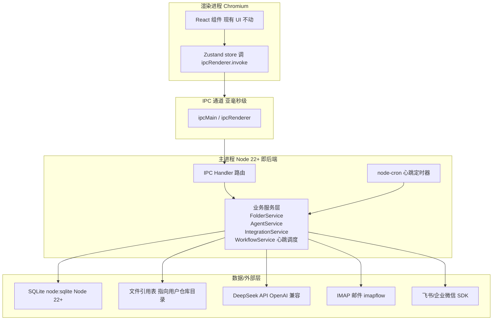

# 技术架构 · 任务指挥中心（Mission Console）

## 1. 总体架构

**形态：Electron 桌面应用（单机、本地优先、npm 全局命令启动）**

参考 [agent-session-search](file:///D:/code/agent-session-search/README.md) 的部署哲学：仓库目录 → `npm ci` → `npm run build` → `npm install -g .` → 终端输入命令启动 → 托盘常驻 + 快捷键唤起。



## 2. IPC 链路说明 关键澄清

**IPC ≠ HTTP，不会慢。**

| 维度 | 传统 Web HTTP | Electron IPC |
|------|---------------|---------------|
| 通信方式 | TCP socket + HTTP 协议 | 操作系统进程间消息 |
| 数据序列化 | 完整 HTTP 报文 | 内存对象传递 |
| 网络栈 | 经过 | 不经过 |
| 典型延迟 | 50–200ms | < 1ms |
| 跨机器 | ✅ | ❌（必须同机） |

**链路对比：**
```
Web：React → fetch → HTTP → Node 服务 → SQLite       50-200ms
Electron：React → ipcRenderer.invoke → 主进程 → SQLite  < 1ms
```

IPC 本质是 Electron 主进程（Node）和渲染进程（Chromium）在**同一台机器上的两个进程**之间的直接消息通道，通过共享内存 / 管道传递，不经过网络栈。

### 2.1 双通道设计

| 通道 | API | 用途 | 触发方向 |
|------|-----|------|---------|
| 请求-响应 | `ipcMain.handle` + `ipcRenderer.invoke` | CRUD 操作：增删改查、读取数据、执行命令 | 渲染进程 → 主进程 |
| 事件推送 | `webContents.send` + `ipcRenderer.on` | 异步通知：Agent 完成动作、接口收到新事件、逾期预警 | 主进程 → 渲染进程 |

**典型场景：**
- 用户勾选待办 → 渲染进程调 `ipcRenderer.invoke('todo:toggle', id)` → 主进程更新 SQLite → 返回新状态 → 渲染刷新
- Agent 心跳完成催办 → 主进程 `mainWindow.webContents.send('agent:event', { type: 'notify', ... })` → 渲染收到 → 通知铃铛红点 + 活动流追加 + Toast 提示

## 3. 端到端链路结构

```
┌─────────────────────────────────────────────────┐
│ Electron 渲染进程（Chromium）                    │
│ ┌─────────────────────────────────────────────┐ │
│ │ React 组件（现有 UI 几乎不动）               │ │
│ │  Dashboard / Folders / FolderDetail / ...   │ │
│ └────────────────┬────────────────────────────┘ │
│                  ↓ 读写                          │
│ ┌─────────────────────────────────────────────┐ │
│ │ Zustand store                                │ │
│ │  现状：直接读 mock.ts                        │ │
│ │  目标：调 ipcRenderer.invoke('xxx')         │ │
│ └────────────────┬────────────────────────────┘ │
└──────────────────┼──────────────────────────────┘
                   ↓ IPC（< 1ms）
┌──────────────────┼──────────────────────────────┐
│ Electron 主进程（Node 22+，你的"后端"）          │
│ ┌────────────────▼────────────────────────────┐ │
│ │ IPC Handler 层（路由）                       │ │
│ │  folder:list / folder:create / todo:toggle  │ │
│ │  agent:trigger / agent:pause / agent:status │ │
│ │  integration:sync / file:resolve            │ │
│ └────────────────┬────────────────────────────┘ │
│                  ↓                              │
│ ┌─────────────────────────────────────────────┐ │
│ │ 业务服务层                                   │ │
│ │  FolderService  AgentService  IntegrationSvc │ │
│ │  WorkflowService（心跳调度）                  │ │
│ └────────────────┬────────────────────────────┘ │
│                  ↓                              │
│ ┌─────────────────────────────────────────────┐ │
│ │ 数据 / 外部层                                │ │
│ │  SQLite(node:sqlite)  文件引用表          │ │
│ │  DeepSeek API  IMAP  飞书SDK  node-cron     │ │
│ └─────────────────────────────────────────────┘ │
└─────────────────────────────────────────────────┘
```

**对前端的影响**：只改 [src/store/useMissionStore.ts](file:///d:/code/workshop/src/store/useMissionStore.ts) 一个文件，把"读 mock"换成"调 IPC"。UI 组件、样式、布局全部不动。

## 4. 技术栈

### 4.1 前端（已完成）
- React@18 + TypeScript + Vite
- TailwindCSS@3 + 自定义设计令牌（黑曜石 + 磷光青）
- Zustand 状态管理
- React Router@6
- framer-motion 动画
- lucide-react 图标

### 4.2 桌面运行时（新增）
- **Electron@最新稳定版**（主进程 + 渲染进程）
- **electron-builder**（可选打包；优先 npm 全局命令模式）
- Node.js 22.13+（与 agent-session-search 对齐）

### 4.3 主进程依赖（新增）
- **node:sqlite**：Node 22.13+ 内置 SQLite 驱动（实验性 API，需 `--experimental-sqlite` flag 或 Node 22.19+ 稳定启用）。**用户须 Node ≥ 22.13**，README 使用说明中明确提示
- **ipcMain / ipcRenderer**：Electron 内置 IPC
- **node-cron**：心跳定时调度
- **imapflow**：邮件 IMAP 拉取
- **@larksuiteoapi/node-sdk** 或 **wecom-sdk**：飞书/企业微信
- **openai**（npm 包）：DeepSeek 兼容 OpenAI 协议，直接用
- **keytar**（可选）：系统 keychain，若后续要加密 key
- **js-yaml**：读写 YAML 配置

> ⚠️ 不再使用 `better-sqlite3`：避免 native module 在不同 Node/Electron ABI 下重编译的坑，改用 Node 内置 `node:sqlite`，零原生依赖。

### 4.4 LLM
- **DeepSeek API**（`deepseek-chat` 模型，OpenAI 兼容协议）
- 通过 `openai` npm 包调用，`baseURL` 改为 `https://api.deepseek.com`

### 4.5 代码工程目录（四段式架构）

```
src/
├── main/                  ← ① Electron 主进程"薄壳"
│   ├── index.ts           窗口/托盘/快捷键/生命周期/IPC 路由注册
│   ├── ipc/               IPC handler 注册（folder:* / agent:* / integration:*）
│   └── scheduler.ts       node-cron 心跳定时器注册（触发器，委托 core）
│
├── preload/               ← ② contextBridge 安全桥
│   └── index.ts           白名单 API 暴露 + 类型导出给 renderer 复用
│
├── renderer/              ← ③ React UI（现有前端壳，零 electron 依赖）
│   ├── components/        AppShell / CopilotPanel / FolderCard / ...
│   ├── pages/             Dashboard / Folders / FolderDetail / ...
│   ├── store/             useMissionStore（调 window.missionConsole）
│   └── types/              前端类型
│
└── core/                  ← ④ 业务大脑（零 electron 依赖，Web 版可复用）
    ├── db/                node:sqlite 封装 + Schema 初始化 + Repository
    ├── agent/             ★ 多 Agent 执行
    │   ├── AgentService.ts      单舱 Agent 调度（调 DeepSeek、写 timeline）
    │   ├── AgentWorkerPool.ts  多舱并发控制
    │   └── strategies/          催办 / 材料归集 / 进度同步 策略
    ├── integrations/      ★ 外部应用接口适配层
    │   ├── adapter.ts          IntegrationAdapter 统一契约（fetch/send）
    │   ├── EmailAdapter.ts     imapflow 实现
    │   ├── FeishuAdapter.ts    飞书 SDK 实现
    │   └── WeComAdapter.ts     企业微信 SDK 实现
    ├── workflow/          ★ 心跳机制业务逻辑
    │   └── WorkflowService.ts  tick()：扫描舱体 → 检查 deadline → 拉接口 → 调 Agent
    ├── services/          FolderService / TodoService / MaterialService
    └── config/            config.yaml 读写
```

**分层依赖规则（严格单向）：**

```
renderer  ──(window.missionConsole)──►  preload  ──(ipcRenderer.invoke)──►  main
                                                                            │
                                                                            ▼
                                                                          core  ◄── 零 electron 依赖
                                                                          │
                                                                  ┌───────┼───────┬─────────┐
                                                                  ▼       ▼       ▼         ▼
                                                               db/    agent/  integrations/  workflow/
```

| 规则 | 说明 |
|------|------|
| `core/` 不得 `import electron` | 保证未来 Web 版可直接复用整个 core 目录 |
| `renderer/` 不得 `import electron` | 只能通过 `window.missionConsole` 调 IPC |
| `main/` 可 `import core/` | 主进程是 core 的宿主，调用其服务 |
| `preload/` 只做桥接 | 零业务逻辑，只暴露白名单 API |
| 数据流方向 | renderer → preload → main → core → db/外部接口 |

**你关心的三个职责落到哪里：**

| 职责 | 目录 | 说明 |
|------|------|------|
| 多 Agent 执行 | `src/core/agent/` | AgentService + WorkerPool + strategies，纯业务 |
| 外部应用接口 | `src/core/integrations/` | Email/Feishu/WeCom 适配器，统一契约 |
| 主流程持续运行 + 心跳 | `src/main/scheduler.ts`（触发器）+ `src/core/workflow/`（大脑）| main 注册定时器，core 执行 tick 逻辑 |

## 5. 数据存储设计

### 5.1 目录布局

```
用户家目录/
├── AppData/Roaming/mission-console/   ← Windows userData
│   ├── mission.db                       ← SQLite 数据库
│   ├── config.yaml                      ← 配置（含 API key）
│   ├── agent-audit.jsonl                ← Agent 审计日志（追加写）
│   └── tray-icon.png
└── <用户配置的仓库目录>/                ← 设置页让用户选
    ├── f-001/                            ← 每个任务舱一个子目录
    │   ├── 归档的文件...
    │   └── notes/
    └── f-002/
```

**说明：**
- `userData`：存放数据库、配置、审计日志，由 Electron 标准目录管理
- 仓库目录：用户在设置页选择，存放主动归档的文件；默认引用的文件不进这里

### 5.2 SQLite Schema

```sql
-- 任务舱
CREATE TABLE folders (
  id TEXT PRIMARY KEY,
  name TEXT NOT NULL,
  category TEXT,
  priority TEXT CHECK(priority IN ('critical','high','medium','low')),
  status TEXT CHECK(status IN ('active','paused','done','archived')),
  deadline INTEGER,           -- unix ms
  progress INTEGER DEFAULT 0,
  cover_color TEXT,
  source_integration TEXT,
  created_at INTEGER,
  updated_at INTEGER
);

-- 待办（支持父子嵌套）
CREATE TABLE todos (
  id TEXT PRIMARY KEY,
  folder_id TEXT NOT NULL,
  parent_id TEXT,             -- 父待办 id，null 为顶层
  title TEXT NOT NULL,
  done INTEGER DEFAULT 0,
  due_date INTEGER,
  assignee TEXT,              -- 'human' | 'agent'
  source TEXT,
  sort_order INTEGER,
  created_at INTEGER,
  FOREIGN KEY(folder_id) REFERENCES folders(id) ON DELETE CASCADE
);
CREATE INDEX idx_todos_folder ON todos(folder_id);

-- 材料引用（默认引用原路径，归档后复制到仓库目录）
CREATE TABLE materials (
  id TEXT PRIMARY KEY,
  folder_id TEXT NOT NULL,
  type TEXT,                  -- 'doc'|'link'|'note'|'image'|'file'
  name TEXT,
  content TEXT,               -- note 内容或 link URL
  storage_mode TEXT,          -- 'ref' 引用 | 'archived' 归档
  original_path TEXT,         -- 原文件路径 ref 模式
  archived_path TEXT,         -- 仓库内相对路径 archived 模式
  source_integration TEXT,
  added_at INTEGER,
  FOREIGN KEY(folder_id) REFERENCES folders(id) ON DELETE CASCADE
);
CREATE INDEX idx_materials_folder ON materials(folder_id);

-- 时间线
CREATE TABLE timeline (
  id TEXT PRIMARY KEY,
  folder_id TEXT NOT NULL,
  actor TEXT,                 -- 'human' | 'agent' | 'system'
  action TEXT,
  meta TEXT,                  -- JSON
  timestamp INTEGER,
  FOREIGN KEY(folder_id) REFERENCES folders(id) ON DELETE CASCADE
);
CREATE INDEX idx_timeline_folder ON timeline(folder_id);

-- Agent 配置
CREATE TABLE agent_configs (
  folder_id TEXT PRIMARY KEY,
  enabled INTEGER DEFAULT 0,
  strategy TEXT,
  permissions TEXT,           -- JSON
  last_action INTEGER,
  FOREIGN KEY(folder_id) REFERENCES folders(id) ON DELETE CASCADE
);

-- 接口适配器
CREATE TABLE integrations (
  id TEXT PRIMARY KEY,
  type TEXT,
  name TEXT,
  description TEXT,
  status TEXT,
  last_sync INTEGER,
  config TEXT                  -- JSON，含 OAuth token 等
);

-- 工作流规则
CREATE TABLE workflows (
  id TEXT PRIMARY KEY,
  name TEXT,
  enabled INTEGER,
  trigger TEXT,                -- JSON
  conditions TEXT,             -- JSON
  actions TEXT,                -- JSON
  runs INTEGER DEFAULT 0,
  last_run INTEGER
);

-- 同步日志（接口拉取/推送记录）
CREATE TABLE sync_log (
  id TEXT PRIMARY KEY,
  integration_id TEXT,
  direction TEXT,              -- 'in' | 'out'
  type TEXT,                  -- 'OK'|'WARN'|'INFO'|'ERR'
  message TEXT,
  payload TEXT,                -- JSON 原始数据
  timestamp INTEGER
);
CREATE INDEX idx_sync_log_int ON sync_log(integration_id);
```

### 5.3 配置文件（config.yaml）

参考 Hermes 的 `~/.hermes/config.yaml` 模式，存在 `userData/config.yaml`：

```yaml
# DeepSeek API
deepseek:
  api_key: "sk-xxx"
  base_url: "https://api.deepseek.com"
  model: "deepseek-chat"

# 心跳调度
agent:
  heartbeat_interval_min: 30   # 心跳间隔（分钟），项目初期节流
  enabled: true

# 开机自启
system:
  auto_launch: false           # 开机自启开关
  tray_icon: true

# 仓库目录
storage:
  vault_dir: ""                 # 用户配置的仓库目录

# 接口配置
integrations:
  email:
    provider: "gmail"           # 'gmail' | 'outlook' | 'imap'
    address: ""
    # OAuth 或 IMAP 凭据
    oauth_token: ""
  feishu:
    app_id: ""
    app_secret: ""
```

## 6. Agent 调度机制（心跳 + 手动）

### 6.1 心跳调度

```typescript
// 主进程，启动时注册
import cron from "node-cron";

const HEARTBEAT = store.config.agent.heartbeat_interval_min; // 默认 30

cron.schedule(`*/${HEARTBEAT} * * * *`, async () => {
  if (!store.config.agent.enabled) return;
  await workflowService.tick(); // 扫描所有 enabled 舱体
  // 完成后通过事件推送通知前端
  mainWindow.webContents.send("agent:heartbeat-done", {
    timestamp: Date.now(),
    actions: [...],
  });
});
```

**默认间隔：30 分钟（项目初期节流模式，可配置）**

**每次心跳做的事：**
1. 遍历所有 `agent_config.enabled = true` 的任务舱
2. 检查 deadline：接近截止 → 生成催办待办
3. 检查接口：拉新邮件/飞书消息 → 决定是否入舱
4. 调 DeepSeek：让 LLM 决策"要不要做动作"
5. 执行动作 → 写入 timeline + audit_log

### 6.2 手动触发

```typescript
// IPC: 手动触发单个舱的 Agent
ipcMain.handle("agent:trigger", async (e, folderId) => {
  return agentService.runOnce(folderId);
});

// IPC: 暂停所有 Agent
ipcMain.handle("agent:pause-all", async () => {
  return agentService.pauseAll();
});
```

### 6.3 Agent 暂停/恢复

- 关机时：所有进度写回 SQLite，Electron 进程退出
- 开机启动：读 SQLite 恢复状态，Agent 按上次断点继续
- 用户主动暂停：标记 `agent_configs.enabled = 0`，心跳跳过

## 7. 文件存储策略（引用 + 可选归档）

### 7.1 默认引用模式

```typescript
// 用户拖文件进任务舱
async function addMaterial(folderId, filePath) {
  const material = {
    id: genId(),
    folder_id: folderId,
    type: detectType(filePath),
    name: path.basename(filePath),
    storage_mode: "ref",            // 引用模式
    original_path: filePath,       // 记录原路径
    archived_path: null,
    added_at: Date.now(),
  };
  await db.insert("materials", material);
}

// 用户点击文件
ipcMain.handle("file:open", async (e, materialId) => {
  const m = await db.get("SELECT * FROM materials WHERE id = ?", materialId);
  const filePath = m.storage_mode === "ref" ? m.original_path : path.join(vaultDir, m.archived_path);
  if (!fs.existsSync(filePath)) {
    return { error: "FILE_MISSING", lastPath: filePath };
  }
  await shell.openPath(filePath);
  return { ok: true };
});
```

### 7.2 主动归档（用户可选）

```typescript
// 用户右键"归档此文件"
async function archiveMaterial(materialId) {
  const m = await db.get("SELECT * FROM materials WHERE id = ?", materialId);
  const folderDir = path.join(vaultDir, m.folder_id);
  fs.mkdirSync(folderDir, { recursive: true });
  const dest = path.join(folderDir, m.name);
  fs.copyFileSync(m.original_path, dest);
  await db.run(
    "UPDATE materials SET storage_mode = 'archived', archived_path = ? WHERE id = ?",
    path.relative(vaultDir, dest), m.id
  );
}
```

| 模式 | 行为 | 优点 | 缺点 |
|------|------|------|------|
| ref（默认） | 只记原路径，不复制 | 磁盘不膨胀 | 原文件移动/删除则失效 |
| archived（手动） | 复制到仓库目录 | 永不丢失 | 占用仓库空间 |

## 8. 接口适配层

### 8.1 统一契约

```typescript
interface IntegrationAdapter {
  id: string;
  type: "email" | "calendar" | "social" | "chat" | "custom";
  status: "connected" | "disconnected" | "error";
  fetch(): Promise<IncomingEvent[]>;
  send(action: OutgoingAction): Promise<void>;
}
```

### 8.2 接入优先级

| 阶段 | 接口 | 方式 |
|------|------|------|
| MVP | 邮件（Gmail/Outlook） | IMAP 拉取（imapflow） |
| P1 | 飞书 | 开放平台 SDK + Webhook |
| P2 | 企业微信 | 企微 SDK |
| 后续 | Telegram / Slack | 各自 Bot API |

## 9. 路由定义

| 路由 | 用途 |
|------|------|
| `/` | 指挥中心 Dashboard |
| `/folders` | 任务舱库列表 |
| `/folders/:id` | 任务舱详情 |
| `/integrations` | 接口舱 |
| `/workflow` | 工作流编排 |
| `/agents` | Agent 控制台 |
| `/settings` | 设置（API key、仓库目录、心跳、自启） |

## 10. 部署模式（参考 agent-session-search）

```bash
# 进入仓库
cd D:\code\workshop

# 安装依赖
npm ci

# 构建
npm run build

# 注册全局命令
npm install -g .

# 启动
mission-console
```

**特征：**
- 不打包 .exe / .dmg 安装包
- npm 全局命令启动
- 托盘常驻后台
- 快捷键唤起（默认 Ctrl+Alt+Space，可改）
- 设置页提供"开机自启"选项

## 11. 实施路径

| 阶段 | 内容 | 依赖 |
|------|------|------|
| Phase 0 | 前端 UI（已完成） | — |
| Phase 1 | Electron 工程化：四段式目录（main/preload/renderer/core）、主进程骨架、IPC 通道、electron-vite 集成 | Phase 0 |
| Phase 2 | SQLite + node:sqlite 集成、Schema 初始化、Seed 数据（需 Node ≥ 22.13） | Phase 1 |
| Phase 3 | Store 层切换：useMissionStore 从 mock 换成 ipcRenderer.invoke（✅ folder/integration/workflow 读操作完成；写操作 + copilot/notification 留到后续 Phase） | Phase 2 |
| Phase 4 | 设置页 + config.yaml 读写 + DeepSeek API key 配置 | Phase 2 |
| Phase 5 | 心跳调度 + Agent worker（调 DeepSeek） | Phase 3, 4 |
| Phase 6 | 邮件接口（IMAP）跑通"邮件→任务舱"闭环 | Phase 5 |
| Phase 7 | 飞书接口接入 | Phase 6 |
| Phase 8 | 文件引用 + 归档机制 | Phase 3 |
| Phase 9 | 打包与 npm 全局命令发布 | 全部 |

### 11.1 Phase 2 子任务拆分

目标：让数据落库到 SQLite，但不接 IPC（Store 层切换留到 Phase 3）。全部在 `src/core/db/` 完成，主进程启动时调用一次 init。

| 步骤 | 模块 | 产出 | 状态 |
|------|------|------|------|
| S1 | `src/core/db/client.ts` | Database 单例 + `initDatabase({ dbPath })` 入口 | ✅ |
| S2 | `src/core/db/schema.ts` | 7 张表建表 SQL（folders / todos / materials / timeline / agent_configs / integrations / workflows / sync_log）| ✅ |
| S3 | `src/core/db/seed.ts` | 从 `src/renderer/data/mock.ts` 抽取的种子数据 INSERT 语句 | ✅ |
| S4 | `src/core/db/migrate.ts` | `schema_version` 表 + 幂等迁移机制（缺表才建，已有跳过）| ✅ |
| S5 | `src/core/repositories/` | 7 个 Repository（FolderRepo / TodoRepo / MaterialRepo / TimelineRepo / AgentConfigRepo / IntegrationRepo / WorkflowRepo），纯 SQL，零 electron | ✅ |
| S6 | `src/main/index.ts` 启动钩子 | `app.whenReady()` 后调 `initDatabase({ dbPath: path.join(app.getPath('userData'), 'mission.db') })` | ✅ |
| S7 | 验证 | typecheck + `npm run build` 通过；dev 启动 + mission.db 生成需用户本机验证 | ✅ |

**关键设计约束：**

| 约束 | 说明 |
|------|------|
| core 不得 import electron | dbPath 由 main 显式传入（字符串参数），保证未来 Web 版可复用 |
| Repository 返回类型复用 renderer/types | 用 `import type` 引入，零运行时依赖 |
| Seed 仅首次启动执行 | 数据库文件不存在时才 seed，之后只 migrate 不覆盖 |
| Migrate 幂等 | 每张表用 `CREATE TABLE IF NOT EXISTS`，可重复执行 |
| node:sqlite 启用 | Node 22.19 稳定启用，无需 flag；import 失败给清晰错误 |

**Seed 数据来源**：[src/renderer/data/mock.ts](file:///d:/code/workshop/src/renderer/data/mock.ts) 的 6 个 folder / 8 个 integration / 4 个 workflow，转成 INSERT 语句。todos/materials/timeline 用嵌套结构展开为单表行（parent_id 字段表达父子嵌套）。
