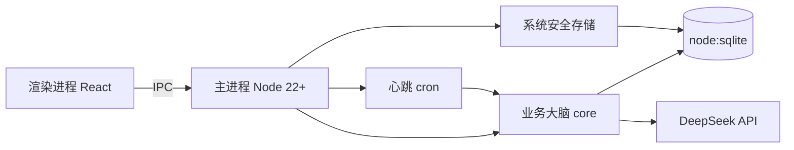

<p align="center">
  <h1 align="center">Mission Console · 任务指挥中心</h1>
  <p align="center">本地优先、Agent 辅助巡检的桌面任务管理工作台</p>
</p>

<p align="center">
  
  
  
  
  
  <a href="./LICENSE"></a>
</p>

<p align="center">
  
</p>

<p align="center"><sub>当前界面仍包含少量用于呈现布局的 Agent 活动与工作流演示数据。</sub></p>

Mission Console 把每一类任务装进一个**任务舱（Folder）**，在同一处管理待办、材料、时间线与 Agent 配置。定时调度器只扫描处于活动状态且已启用 Agent 的任务舱；配置 DeepSeek 后，可按设定间隔（默认每小时）或手动发起巡检，并把结果写回时间线。业务数据保存在本地 SQLite，应用配置保存在本地 YAML。界面采用冷中性灰白基底的现代生产力工作台风格，以克制的产品蓝、细描边、轻阴影和紧凑信息密度保证长时间使用的清晰度。

## ✨ Features

- **任务舱架构** — 每类任务一个舱，集中管理待办、材料、时间线、Agent 配置
- **本地材料管理** — 通过系统文件选择器添加引用，可打开或移除引用，不删除磁盘原文件
- **Agent 定时巡检** — 默认每 60 分钟执行，支持 5–1440 分钟调整、手动触发、超时取消与运行事件推送
- **DeepSeek 接入** — 使用 OpenAI 兼容协议；执行 Agent 时会把当前任务舱必要上下文发送给所配置的模型 API
- **适配器注册表** — 可维护服务商、地址、端口与认证信息；敏感字段由 Electron `safeStorage` 加密后落库
- **本地优先** — 业务数据存 `node:sqlite`，应用配置存 YAML，本地文件默认采用引用模式
- **浅色生产力界面** — 冷灰白中性基底 + 克制产品蓝，细描边与轻阴影，全局快捷键唤起，托盘常驻

> 当前适配器仅完成本地注册和配置管理，Gmail、飞书、Slack 等第三方连接运行时尚未接入；工作流页面目前是规则管理与编排界面，执行引擎仍在开发中。

## 🖼 Screenshots

### 任务舱

<p align="center">
  
</p>

### 接口与工作流

<p align="center">
  
</p>

<p align="center"><sub>截图中的服务均为本地配置示例，未表示第三方运行时已经连接。</sub></p>

<p align="center">
  
</p>

<p align="center"><sub>工作流执行器和可拖拽节点编辑仍处于开发阶段。</sub></p>

### Agent 控制台

<p align="center">
  
</p>

<p align="center"><sub>当前实际执行模型为任务舱内的单舱 Agent；列表统计和部分审计内容仍含演示数据。</sub></p>

## 🚀 Quickstart

### 环境要求

- **Node.js ≥ 22.13**（使用内置 `node:sqlite`，无需 native module）
- Windows 10/11 或 macOS 12+

### 安装与启动

```bash
git clone https://github.com/CuSO41108/mission-agent.git
cd mission-agent
npm ci
npm run dev
```

构建并从本机命令行启动：

```bash
npm run build
npm install -g .
mission-console
```

关闭主窗口后应用会留在托盘。按 **Ctrl+Alt+Space**（macOS：Option+Space）可再次唤起，彻底退出请使用托盘菜单。

### 首次配置

1. 托盘右键 → 打开设置
2. **DeepSeek 配置**：填入 API key → 点"测试连接"验证
3. **心跳调度**：调整间隔（默认 60 分钟，可设为 5–1440 分钟）→ 开启全局开关
4. **仓库目录**：设置文件归档目录（可选，默认引用模式不复制）
5. **适配器配置**：按需登记服务地址和认证信息；当前仅保存配置，不会连接第三方服务

DeepSeek API key 当前保存在本机 `userData/config.yaml`。运行 Agent 时，任务舱名称、状态、待办及材料名称等必要上下文会发送到所配置的模型服务，请根据数据敏感度决定是否启用。

## 🧱 Architecture



- **四段式目录**：`src/main`（Electron 生命周期与 IPC）/ `src/preload`（contextBridge 白名单）/ `src/renderer`（React UI）/ `src/core`（业务与数据层）
- **IPC 双通道**：`ipcMain.handle` 做 CRUD + `webContents.send` 做事件推送
- **数据层**：`node:sqlite` 嵌入式 SQLite，8 张业务表 + `schema_version`
- **配置层**：通用应用配置存入 `userData/config.yaml`；适配器敏感字段经系统安全存储加密后写入 SQLite
- **调度层**：`node-cron` 心跳 + 防重入 + 请求超时；仅执行 `active + Agent enabled` 的任务舱
- **适配器层**：本地注册、编辑、删除和凭据状态已完成；各服务商运行时待后续实现
- **工作流层**：规则持久化与页面展示已存在，节点编排和实际执行尚未完成

详细架构图、Schema、IPC 链路见 [TechnicalArchitecture.md](.trae/documents/TechnicalArchitecture.md)

## 🗂 Project Structure

```
src/
├── main/          # 主进程：窗口/托盘/快捷键/生命周期/IPC 注册/scheduler
├── preload/       # contextBridge 白名单 API + 类型导出
├── renderer/      # React UI（Dashboard/Folders/Settings/...）
└── core/          # 业务大脑（零 electron 依赖）
    ├── db/        # node:sqlite + Schema + 迁移 + Repository
    ├── config/    # AppConfig + YAML 读写
    ├── services/  # 任务舱、材料、适配器等业务服务
    ├── agent/     # DeepSeek 客户端 + 单舱 Agent 执行器（prompt → timeline）
    └── workflow/  # 心跳巡检策略（active + enabled）
```

## 📄 License

MIT License © 2026 CuSO41108

---

有任何问题，请提交 issue。如果觉得我们的项目还不错，欢迎 star ✨。也欢迎 PR。
