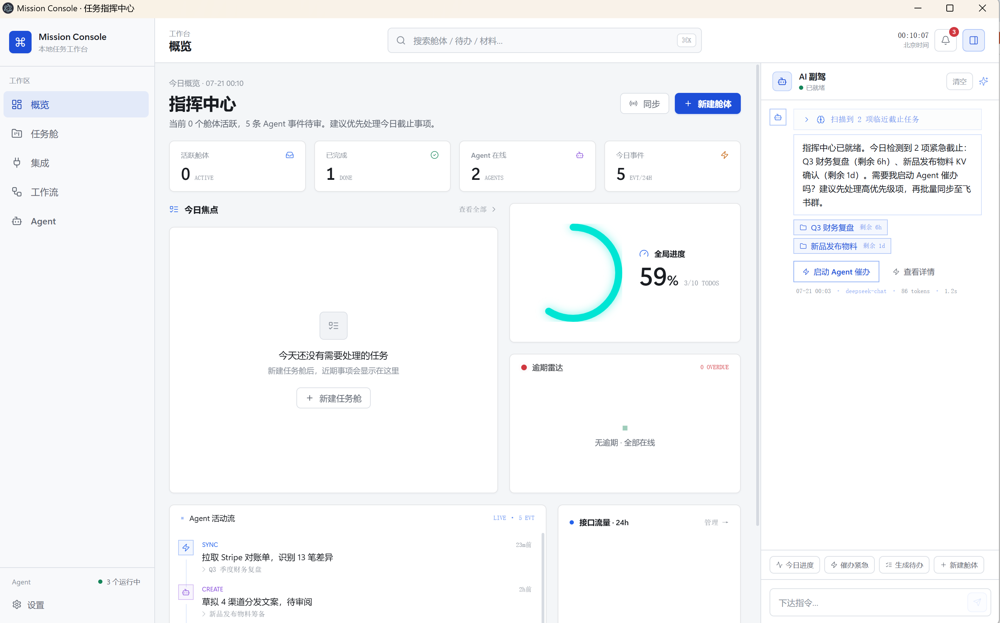
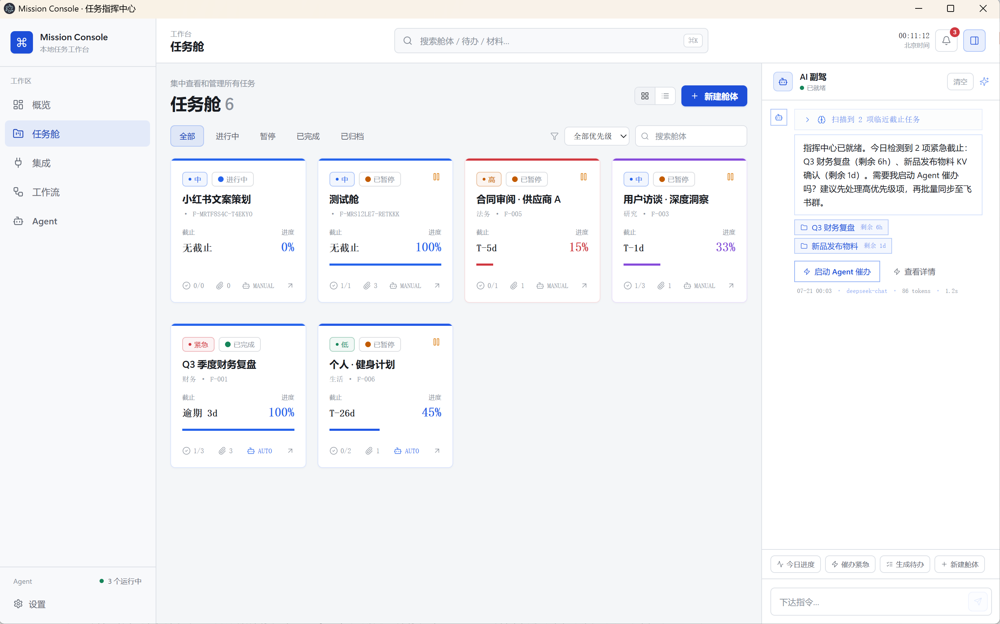
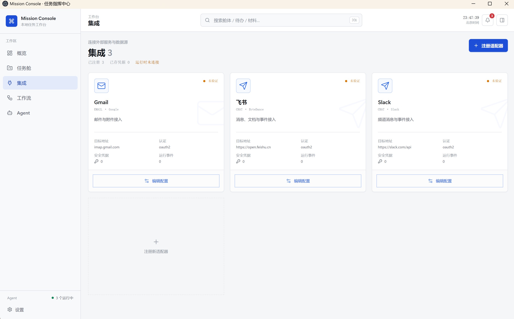
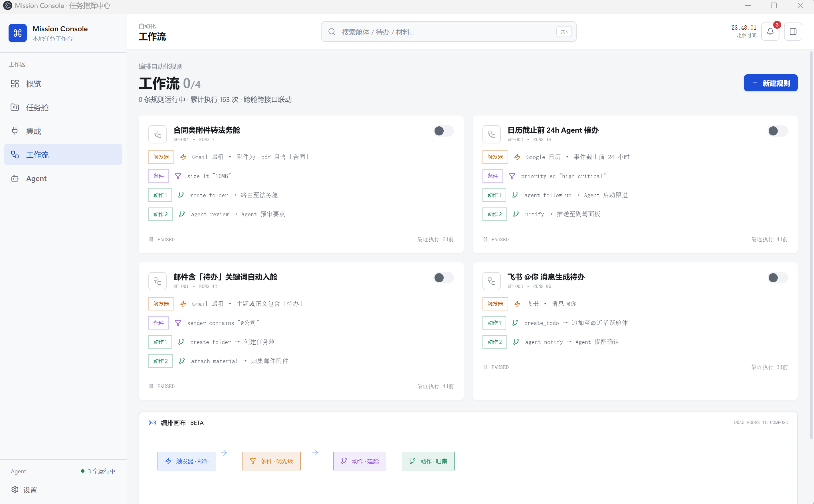
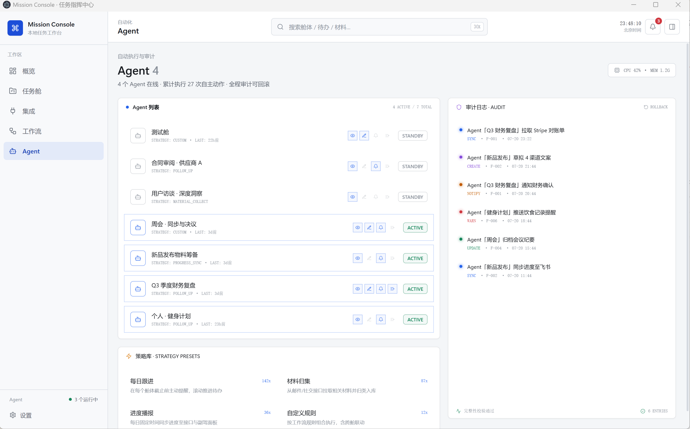
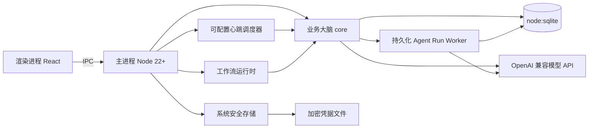

<p align="center">
  <h1 align="center">Mission Console · 任务指挥中心</h1>
  <p align="center">本地优先、支持受控并行 Agent Run 的个人任务工作台</p>
</p>

<p align="center">
  
  
  
  
  
  <a href="./LICENSE"></a>
</p>

<p align="center">
  
</p>

Mission Console 把每一类任务装进一个**任务舱（Folder）**，在同一处管理待办、材料、时间线与 Agent 配置。定时调度器只扫描处于活动状态且已启用 Agent 的任务舱；配置任意 OpenAI 兼容模型 API 后，可按设定间隔（默认每小时）或手动发起巡检。Agent Run 会先写入本地持久化队列，在并发额度与资源锁可用后自动执行；不同任务舱可受控并行（默认 2、可调 1–4），同一任务舱当前保持互斥。业务数据保存在本地 SQLite，普通应用配置保存在本地 YAML，模型 API Key 由 Electron `safeStorage` 加密保存。

## ✨ Features

- **任务舱架构** — 每类任务一个舱，集中管理待办、材料、时间线、Agent 配置
- **本地材料管理** — 通过系统文件选择器添加引用，可打开或移除引用，不删除磁盘原文件
- **Agent 定时巡检与受控并行** — 默认每 60 分钟执行，支持 5–1440 分钟调整、手动触发、超时取消与运行事件推送；不同任务舱默认最多 2 个 Run 并发，可调为 1–4
- **持久化 Run 队列与资源互斥** — Run 按 `queued → running → terminal` 流转；资源忙时持续等待并在释放后自动启动，应用重启会恢复排队项
- **安全中断与人工重试** — 异常退出时遗留的 `running` Run 标记为 `APP_INTERRUPTED`，不会自动重放潜在副作用；可在运行控制台取消或创建有关联记录的新重试 Run
- **类型化 Agent 待办** — 分析、生成产物、跟进提醒、材料整理、进度摘要与工作流任务分开执行；只有明确选择产物任务才写文件
- **多种本地产物** — Markdown 为推荐默认格式，同时支持纯文本与 JSON；分析型待办不会自动生成文件或标记完成
- **OpenAI 兼容模型** — DeepSeek 只是默认配置示例，Base URL 与模型名均可更换为其他兼容服务
- **可执行工作流** — 支持创建、编辑、删除、启停、手动/定时/事件触发、拖拽节点、条件判断、运行记录与循环保护
- **适配器注册表** — 可维护服务商、地址、端口与认证信息；敏感字段由 Electron `safeStorage` 加密后落库
- **本地优先** — 业务数据存 `node:sqlite`，应用配置存 YAML，本地文件默认采用引用模式
- **浅色生产力界面** — 冷灰白中性基底 + 克制产品蓝，细描边与轻阴影，全局快捷键唤起，托盘常驻

> 当前适配器仅完成本地注册和配置管理，Gmail、飞书、Webhook 等第三方连接运行时尚未接入，因此不会作为可执行工作流节点出现。

## 🖼 Screenshots

### 任务舱

<p align="center">
  
</p>

### 接口与工作流

<p align="center">
  
</p>

<p align="center"><sub>截图中的服务均为本地配置示例，未表示第三方运行时已经连接。</sub></p>

<p align="center">
  
</p>

<p align="center"><sub>当前 V1 提供本地触发器、条件和动作；第三方节点将在对应运行时接入后开放。</sub></p>

### Agent 控制台

<p align="center">
  
</p>

<p align="center"><sub>Agent 执行结果会通过主进程事件通知渲染层重新读取 SQLite，数据库是唯一业务真相。</sub></p>

## 🚀 Quickstart

### 环境要求

- **Node.js ≥ 22.13**（使用内置 `node:sqlite`，无需 native module）
- Windows 10/11 或 macOS 12+

### 安装与启动

```bash
git clone https://github.com/CuSO41108/mission-agent.git
cd mission-agent
npm ci
npm run dev
```

构建并从本机命令行启动：

```bash
npm run build
npm install -g .
mission-console
```

关闭主窗口后应用会留在托盘。按 **Ctrl+Alt+Space**（macOS：Option+Space）可再次唤起，彻底退出请使用托盘菜单。

### 首次配置

1. 托盘右键 → 打开设置
2. **模型配置**：填写 OpenAI 兼容 API 的 Base URL、模型名与 API Key；DeepSeek 是默认示例，不是必选项
3. **心跳调度**：调整间隔（默认 60 分钟，可设为 5–1440 分钟）→ 开启全局开关
4. **仓库目录**：设置文件归档目录（可选，默认引用模式不复制）
5. **适配器配置**：按需登记服务地址和认证信息；当前仅保存配置，不会连接第三方服务

模型 API Key 会从旧版 YAML 自动迁移至 Electron `safeStorage` 加密文件，渲染进程只能看到“已配置”状态，无法读取完整 Key。设置页留空表示保留现有 Key，只有输入新值才会覆盖。点击“测试连接”会产生一次真实 API 请求；运行 Agent 时，启用“读取”权限的任务舱上下文及任务需要的本地文本材料会发送到所配置的模型服务，请根据数据敏感度决定是否启用。

## 🧱 Architecture



- **四段式目录**：`src/main`（Electron 生命周期与 IPC）/ `src/preload`（contextBridge 白名单）/ `src/renderer`（React UI）/ `src/core`（业务与数据层）
- **IPC 双通道**：`ipcMain.handle` 做 CRUD + `webContents.send` 做事件推送
- **数据层**：`node:sqlite` 嵌入式 SQLite，11 张业务表 + `schema_version`，包含 Agent Run 与资源租约记录
- **配置层**：普通应用配置存入 `userData/config.yaml`；模型 Key 与适配器敏感字段先经系统安全存储加密，渲染层只获取配置状态
- **调度层**：心跳或手动操作先创建持久化 Run，Worker 按 FIFO 扫描并跳过资源冲突项；资源释放、Run 结束、配置变化或应用启动都会立即再次泵队列。Agent 与 Copilot 调用同一模型时共享并发额度
- **适配器层**：本地注册、编辑、删除和凭据状态已完成；各服务商运行时待后续实现
- **工作流层**：独立事件总线与定时轮询驱动本地节点，支持修改任务舱状态、创建待办、运行 Agent、写时间线和应用内通知

详细架构图、Schema、IPC 链路见 [TechnicalArchitecture.md](.trae/documents/TechnicalArchitecture.md)

## 🗂 Project Structure

```
src/
├── main/          # 主进程：窗口/托盘/快捷键/生命周期/IPC 注册/scheduler
├── preload/       # contextBridge 白名单 API + 类型导出
├── renderer/      # React UI（Dashboard/Folders/Settings/...）
└── core/          # 业务大脑（零 electron 依赖）
    ├── db/        # node:sqlite + Schema + 迁移 + Repository
    ├── config/    # AppConfig + YAML 读写
    ├── services/  # 任务舱、材料、适配器等业务服务
    ├── agent/     # 持久化 Run Worker + OpenAI 兼容客户端 + 类型化单舱 Agent 执行器
    └── workflow/  # 工作流引擎、事件总线与心跳巡检策略
```

## 📄 License

MIT License © 2026 CuSO41108

---

有任何问题，请提交 issue。如果觉得我们的项目还不错，欢迎 star ✨。也欢迎 PR。
