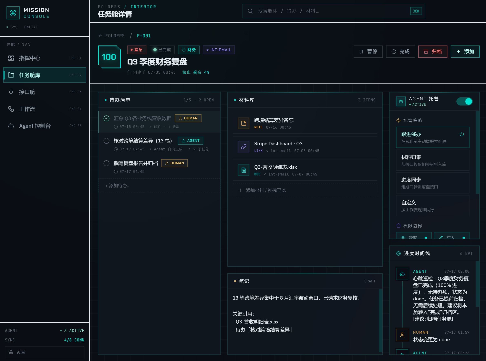
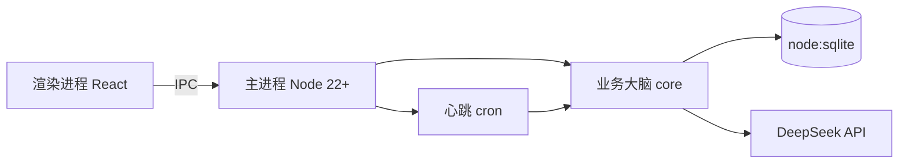

<p align="center">
  <h1 align="center">Mission Console · 任务指挥中心</h1>
  <p align="center">本地优先、Agent 自动托管的桌面任务管理工作台</p>
</p>

<p align="center">
  
  
  
  
  
  <a href="./LICENSE"></a>
</p>

<p align="center">
  
</p>

Mission Console 把每一类任务装进一个**任务舱（Folder）**，舱内集中管理待办、材料、时间线与 Agent 配置。Agent 按心跳节律自动巡检，催办临近截止、回写进度到时间线。数据存本地 SQLite，配置存 YAML，零云端依赖。界面采用黑曜石 + 磷光青的赛博 HUD 风格，参考若干优秀开源项目的设计取向。

## ✨ Features

- **任务舱架构** — 每类任务一个舱，集中管理待办、材料、时间线、Agent 配置
- **Agent 自动托管** — 按心跳节律巡检，催办临近截止、回写进度，支持手动触发与暂停
- **DeepSeek 驱动** — 内置 DeepSeek API 接入，OpenAI 兼容协议，本地配置零上传
- **本地优先** — 数据存 `node:sqlite`，配置存 YAML，文件引用不复制，零云端依赖
- **赛博 HUD 界面** — 黑曜石 + 磷光青主题，全局快捷键唤起，托盘常驻

## 🖼 Screenshots

### 任务舱

<p align="center">
  
</p>

<p align="center">
  
</p>

### 接口与工作流

<p align="center">
  
</p>

<p align="center">
  
</p>

### Agent 控制台

<p align="center">
  
</p>

## 🚀 Quickstart

### 环境要求

- **Node.js ≥ 22.13**（使用内置 `node:sqlite`，无需 native module）
- Windows 10/11 或 macOS 12+

### 安装与启动

```bash
git clone https://github.com/CuSO41108/mission-agent.git
cd mission-agent
npm ci
npm run build
npm install -g .
mission-console
```

启动后默认隐藏到托盘，按 **Ctrl+Alt+Space**（macOS：Option+Space）唤起窗口。

### 首次配置

1. 托盘右键 → 打开设置
2. **DeepSeek 配置**：填入 API key → 点"测试连接"验证
3. **心跳调度**：调整间隔（默认 30 分钟）→ 开启全局开关
4. **仓库目录**：设置文件归档目录（可选，默认引用模式不复制）

## 🧱 Architecture



- **四段式目录**：`src/main`（薄壳）/ `src/preload`（contextBridge）/ `src/renderer`（React UI）/ `src/core`（业务大脑，零 electron 依赖，未来 Web 版可复用）
- **IPC 双通道**：`ipcMain.handle` 做 CRUD + `webContents.send` 做事件推送
- **数据层**：`node:sqlite` 嵌入式 SQLite，8 张表
- **配置层**：YAML 存 `userData/config.yaml`
- **调度层**：`node-cron` 心跳 + 防重入

详细架构图、Schema、IPC 链路见 [TechnicalArchitecture.md](.trae/documents/TechnicalArchitecture.md)

## 🗂 Project Structure

```
src/
├── main/          # 主进程：窗口/托盘/快捷键/生命周期/IPC 注册/scheduler
├── preload/       # contextBridge 白名单 API + 类型导出
├── renderer/      # React UI（Dashboard/Folders/Settings/...）
└── core/          # 业务大脑（零 electron 依赖）
    ├── db/        # node:sqlite + Schema + Seed + 7 Repository
    ├── config/    # AppConfig + YAML 读写 + DeepSeek 客户端
    ├── services/  # 业务编排层（组装父子嵌套、写操作留痕）
    ├── agent/     # 单舱 Agent 执行器（prompt → DeepSeek → timeline）
    └── workflow/  # 心跳调度主逻辑（tick 扫描所有 enabled 舱体）
```

## 📄 License

MIT License © 2026 CuSO41108

---

有任何问题，请提交 issue。如果觉得我们的项目还不错，欢迎 star ✨。也欢迎 PR。
